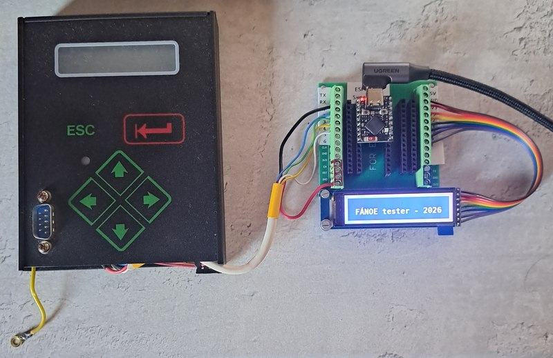
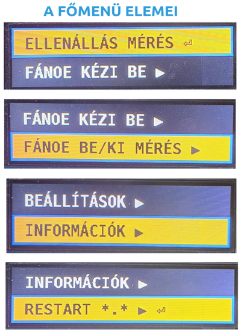

# FÁNOE tester

**Status:** Under active development - started by Gyuri on 2026. july

Sorry folks, this repo comes with Hungarian comments only 🙂<br> 

Ez a repository egy ESP32-S3 alapú, CircuitPython-ban futó diagnosztikai eszközhöz készült firmware-t és kapcsolódó forrásfájlokat tartalmazza.  
### A projekt célja egy billentyűzettel és egy kis TFT kijelzővel működő, menüvezérelt tesztműszer összeállítása.  

<table>
  <tr>
    <td align="center">
      
    </td>
    <td align="center">
      
    </td>
   </tr>
</table>

## Rövid bemutató

A rendszer a következő funkciókat szolgálja:
- ellenállás mérés [0-500Ω]
- relé működtetéshez kimenet vezérlés
- kontaktus bemenet időméréssel
- teljes mérési ciklus futtatása
- menüvezérelt felület a kijelzőn
- billentyűzetes navigáció
- beállítások, információs oldalak és mérési üzemmódok
- CircuitPython-alapú futtatás ESP32-S3 hardveren

A fő program a [code.py](code.py) fájlban található, a menüstruktúra a [menu_data.py](menu_data.py), a kijelző üzenetek a [tft_messages.py](tft_messages.py) fájlban vannak definiálva. A rendszerindítási viselkedést a [boot.py](boot.py) fájl kezeli.

## Kapcsolási rajz
```
                      TÁPFESZÜLTSÉG
PullUp resistors          REPL
   on the PCB              ↓
     ↓                   USB-C                  2.25" SPI TFT
          K           ┌────┬──┬────┐      ┌──────────────────────────┐
    5,6k -E--Column1-─┤IO1 └──┘IO13├──────┤SCL                      +├─ 3V3
    5,6k -Y--Column2-─┤IO2     IO12├──────┤SDA                      -├─ GND  
    5,6k -P--Column3-─┤IO3     IO11├──────┤RST      ST7789SP3        │  
          A ── Row1-──┤IO4     IO10├──────┤DC                        │   
          D ── Row2-──┤IO5     IO9 ├──────┤CS         76*284         │   
                      │        IO8 ├──────┤BL                        │ 
 [ENTER] [LEFT] [UP]  │            │      └──────────────────────────┘
 [ESC] [RIGHT] [DOWN] │  ESP32-S3  │  
                      │ Super Mini │  3V3
                      │            │  ┌┴┐
 NO Contact->-DigIn ──┤IO6         │  │ │150     
                      │            │  └┬┘ 
    Relay-<-DigOut--──┤IO7    *IO14├───┴──-<---[Rx]---GND
                      └────────────┘
```

## Hardver

A projekthez használt hardverösszetevők:
- ESP32-S3 Super Mini alaplap
- 6 gombos Protecta mátrix billentyűzet
- 76×284 pixel-es ST7789 vezérlésű TFT kijelző
- USB-C kapcsolat fejlesztéshez / hibakereséshez

## Fájlok és szerepük

- [code.py](code.py) – a fő alkalmazás, a kijelzővezérlés, billentyűzetkezelés és a menü,- és méréslogika.
- [menu_data.py](menu_data.py) – a menüfa és a felhasználói felület adatai.
- [tft_messages.py](tft_messages.py) - A szines kijelző üzenetei.
- [boot.py](boot.py) – induláskor beállítja a felhasználói / fejlesztői módot, és kezeli az USB-meghajtó viselkedését.
- [instructions/](instructions/) – hardver- és szoftver-specifikus dokumentációk.
- [fonts/](fonts/) – a kijelzőn használt betűtípusok, karakterek.
- [lib/](lib/) – a CircuitPython futtatáshoz szükséges könyvtárak.

### Az összes kód és a kapcsolódó fájlok zöme - ingyenes Ai támogatással készült.
Ezek gerincét a Claude (Sonet5 - medium) free alkotta, webböngészős projekt környezetben futtatva.  
A nyelvi modell működési irányát az [AGENTS.md](AGENTS.md) és a [.copilot-instructions.md](.copilot-instructions.md) jelöli ki.

A REPL megjelenítése, a fájlok gyors feltöltése és ellenőrzőse a Thonny 4.1.7 programmal történt.

A VsCode 1.13x.x főként a szöveges szerkesztésben és a verzió követésben segédkezett.

## Telepítés és futtatás

1. Telepítsd a CircuitPython firmware-t az ESP32-S3 Super Mini boardra.
2. Másold a repository tartalmát a CIRCUITPY meghajtóra.
3. Győződj meg róla, hogy a szükséges könyvtárak a megfelelő helyen vannak a [lib/](lib/) mappában.
4. Indítsd újra a készüléket.
5. A [boot.py](boot.py) alapján a rendszer felhasználói vagy fejlesztői üzemmódban indulhat.

## Üzemmódok

A bootfázisban a GPIO21-es kapcsoló állapota alapján dönt a rendszer:
- felhasználói mód: az USB meghajtó inaktív, a program számára engedélyezett a fájlírás
- fejlesztői mód: az USB meghajtó aktív, ami a fejlesztéshez hasznos

## Fejlesztés, áttekintés

A projekt dokumentációja az [instructions/](instructions/) mappában található.  
A fényképes dokumentálás az [images/](images/) mappában található.   

## Megjegyzés

Ez a projekt jelenleg aktív fejlesztés alatt áll, így a funkciók és a menüelemek folyamatosan változnak.
