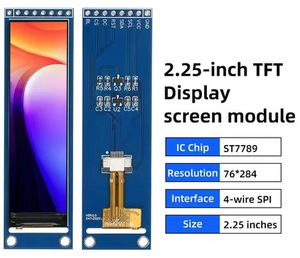

# 2.25" color TFT SPI Display - ST7789
### EXPLANATION FOR CARBON-BASED DEVELOPERS 😊
  

*English:*
The 2.25" TFT display is a color graphic display with a resolution of 76 × 284 pixels. Its compact size makes it a suitable replacement for the classic 2×16 character LCD. It uses the ST7789 controller and communicates over SPI, requiring five signal lines: SCL, SDA, RST, DC (CS). As a TFT panel, it requires a backlight — the PWM-capable pin for this is BL. The module accepts 3.3V VCC supply voltage; always refer to the specific module's datasheet for wiring. The display is ideal for colorful, high-contrast text, icons, gauges, and more complex dashboards.  
The display of Hungarian accented characters and the symbols used is provided from a *.bdf file.  

*Magyar:*
A 2,25" TFT kijelző egy szines, grafikus megjelenítő, 76 x 284 pixeles felbontással. A mérete miatt alkamas a régi, 2*16 karakteres LCD kijelző kiváltására. Az ST7789 vezérlőt használja, és SPI buszon kommunikál, amihez öt jelvezeték kell: SCL, SDA, RST, DC (CS). Mivel TFT panelről van szó, háttérvilágítás szükséges - ennek a PWM képes kapcsa: BL. A modul 3,3V VCC tápfeszültséget fogad el; huzalozásnál mindig a konkrét modul adatlapja az irányadó. A kijelző szines, nagy kontrasztú szövegekhez, ikonokhoz, műszerekhez és összetetteb dashboardokhoz ideális.  
A magyar ékezetes karakterek és a használt szimbólumok megjelenítése egy *.bdf fájlból történik.  

### Key Technical Specifications - Főbb műszaki jellemzők
*English:*
- Display type: Colorful TFT graphic display.
- Controller: ST7789.
- Resolution: 76 x 284 pixels (native, portrait). Used rotated 90° in this project → effective canvas 284 x 76 (landscape).
- Interface: SPI communication.
- Supply: Typical modules support 3.3V VCC.
- Pins: GND, VCC, SCL (SCK), SDA (MOSI), RST, DC, CS, BL.
- Backlight: BL pin, PWM-capable — required, this is a TFT panel (not self-luminous).
- Typical module size: About 2.25" diagonal, bar style.

*Magyar:*
- Kijelző típusa: szines TFT grafikus kijelző.
- Vezérlő: ST7789.
- Felbontás: 76 x 284 pixel (natív, álló). A projektben 90°-kal elforgatva → effektív felület 284 x 76 (fekvő).
- Interfész: SPI kommunikáció.
- Táp: 3,3V VCC.
- Lábak: GND, VCC, SCL (SCK), SDA (MOSI), RST, DC, CS, BL.
- Háttérvilágítás: BL kivezetés, PWM képes — kötelező, mert ez egy TFT panel (nem önvilágító).
- Jellemző méret: 2.25" képátló, bar típusú.

> ⚠️ Az instrukció forrásai:
> - Waveshare ST7789 wiki:: https://www.waveshare.com/w/upload/a/ad/ST7789VW.pdf
> - Acessories Blog: https://www.studiopieters.nl/2-25-inch-tft-lcd-st7789-spi-display/

---
## NECESSARY DATA FOR THE AGENT
### PIN Reference
Dedicated pins (Aliases in brackets are common module silkscreen labels / names used in the project's working example code)

| PIN | Function                              |      Aliases      |
| --- | ------------------------------------- | ----------------- |
| GND | System ground                         |                   |
| VCC | Power input, typically 3.3V           |                   |
| SCL | SPI clock line                        | SCK, TFT_SPI_SCL  |
| SDA | SPI data line (controller MOSI input) | MOSI, TFT_SPI_SDA |
| RST | Hardware reset                        | TFT_RST_PIN       |
| DC  | Data/Command select                   | TFT_DC_PIN        |
| CS  | Chip select                           | TFT_CS_PIN        |
| BL  | Backlight control, PWM-capable        | BACKLIGHT_PIN     |

*Notes:*
- This is a 4-wire SPI module: SCL/SDA are the SPI clock/data lines, plus separate RST, DC, and CS pins — not to be confused with I2C SCL/SDA naming.
- Backlight (BL) is mandatory for this panel; it is normally driven via PWM for brightness control (see working example below).
- Native panel geometry is 76 (width) x 284 (height). This project rotates the display 90° in software, so code should generally work in the 284 x 76 landscape orientation with `colstart`/`rowstart` offsets — see the working example for typical values.

### CODE GENERATION LOGIC & RULES

**1. Display Driver Choice:**
- Prefer the most idiomatic display library for the target environment.
- For **CircuitPython**, prefer `displayio` with the `adafruit_st7789.ST7789` driver over `FourWire`, rather than manual SPI byte pushing.
- For **MicroPython**, prefer a mature ST7789 driver module over handwritten protocol code.
- For **Arduino/C++**, prefer a tested ST7789/TFT library (e.g. Adafruit_ST7789) rather than custom bit-banging unless the user explicitly requests a low-level implementation.

**2. Initialization Logic:**
- Always initialize the display with the correct native geometry: **76 x 284**, applying `rotation=90` (or the project-standard rotation) to get the working 284 x 76 landscape canvas, unless the user's UI explicitly needs portrait mode.
- Always set `colstart`/`rowstart` offsets — this panel is not full-frame addressable from (0,0); use the values validated in the project's working example unless the user's specific module datasheet says otherwise.
- Clear the screen (fill background / show an empty group) immediately after initialization to avoid ghost content.
- Apply additional rotation, inversion, or color order only when explicitly needed by the user's hardware revision or UI design — some ST7789 batches differ in color order (RGB vs BGR).  
- **Color inversion check:** if colors appear as their complement (e.g. red shows as cyan, white as black), pass `invert=False` (or `True`, whichever is not the library default) to the `ST7789()` constructor — some ST7789 panels are wired for the opposite of the driver's default `invert` setting. This is a per-panel hardware trait, not a code bug; verify visually once per new panel/module. (see the Example-3)

**3. SPI Handling:**
- Use hardware SPI (`busio.SPI`) whenever possible; avoid bit-banged/software SPI unless the platform has no free hardware SPI peripheral.
- Keep the bus speed within the library/driver defaults unless the target platform and wiring are known to be stable at a higher speed.
- CS, DC, and RST are separate GPIO pins (not shared with the SPI clock/data lines) — always wire and configure them explicitly via `FourWire` (or the equivalent construct in other frameworks).
- If the display does not initialize or shows a blank/garbled screen, check wiring and pin assignment (CS, DC, RST, SCK, MOSI) before assuming a code-level display driver bug.

**4. Rendering Rules:**
- Treat the panel as a compact UI surface — effective usable area is 284 x 76 (landscape) or 76 x 284 (portrait), depending on chosen rotation.
- Prefer short labels, compact status text, small icons, and high-contrast layouts; this is a narrow strip-style display, similar in spirit to the 2×16 character LCD it replaces, but with color and graphics available.
- Avoid long paragraphs, thin fonts, and dense tables on-screen.  
- This project uses a fixed 2 lines; design layouts around exactly 2 rows  
- When updating the screen, redraw only the portions that changed (update the relevant `displayio` group/bitmap region) rather than rebuilding the whole `Group` tree every refresh cycle, where practical.
- In animation loops or frequently-updated readouts (e.g. live measurement values), avoid unnecessary full-screen refreshes at very high rates — this can cause visible flicker and unnecessary CPU/SPI load.

**5. Power and Electrical Rules:**
- This is a TFT panel and requires an active backlight — never assume the display is self-luminous. The BL pin must be driven (tied high or PWM-controlled) or the screen will appear black even if the controller is initialized correctly.
- Prefer PWM control of BL over a simple digital on/off, to allow brightness ramping and dimming (see the working example's `BacklightController`). PWM is recommended but not mandatory.
- Do not confuse module VCC (3.3V logic/power) with backlight LED forward voltage/current — check the specific module's datasheet if driving the backlight from anything other than the module's own BL pin circuitry.
- If the user targets a bare ST7789 panel instead of a finished breakout module, re-check the voltage, backlight driving, and level-shifting requirements from the datasheet before generating code or wiring guidance.

**6. Text and Font Handling:**
- **This project uses a fixed 2-line layout on this display.** Load the font from `/fonts/hu_127_ekezetes_24.bdf` (24px, bold, full 127-glyph set: ASCII + Hungarian accented + UI icons + bonus symbols)
- **Vertical position is font-specific, not calculated from line height.** With this font/size, the two `label.Label` instances must use `y=-2` (line 1) and `y=29` (line 2) — not `y=20`/`y=50` as a naive line-height estimate would suggest. This offset comes from the font's own `FONT_ASCENT`/`FONT_DESCENT` metrics and is constant for this font regardless of the text content or which screen/menu is shown.
- If a new layout requiring 1 or 3+ lines is introduced later, new Y-offsets must be empirically measured on the physical display for that font — do not assume the 2-line values transfer to a different line count.
- **Hungarian accented characters (á, é, í, ó, ö, ő, ú, ü, ű and uppercase) are required for this project's UI text.** `terminalio.FONT` does NOT support these — do not use it for any user-facing text.
- **Always load the custom font** at `/fonts/hu_127_ekezetes_24.bdf` via `adafruit_bitmap_font` for all `label.Label` text on this display, instead of `terminalio.FONT`:
- Load the font once at startup (e.g. in `DisplayController.__init__`) and reuse the same `font` object for every `label.Label` — do not reload it per screen/redraw.
- If a required glyph is missing from `hu_127_ekezetes_24.bdf` (e.g. a symbol not yet included), flag this to the user rather than silently falling back to `terminalio.FONT`, since mixing fonts looks inconsistent on such a small panel.
- Requires `adafruit_bitmap_font` and `adafruit_display_text` in `/lib` (per the project's CircuitPython rules — prefer official `adafruit_...` libraries).

**7. Error Handling:**
- If the display does not respond or initialization raises an exception, generate code that reports the pin configuration and initialization failure clearly via `dprint`/Serial REPL, rather than failing silently.
- Fail gracefully: if the TFT is missing or fails to initialize, keep the rest of the application (measurement logic) running and log the issue instead of crashing the whole program.


> **🤖 SYSTEM NOTE FOR THE AI AGENT:**  
> This document defines hardware-specific operational rules and physical constraints. When generating code, **adapt these rules to the specific programming language, framework, and environment requested by the user in the active prompt.** Always use the most idiomatic and efficient approach for the target environment (e.g., native libraries for CircuitPython, interrupts for C++/MicroPython) while strictly respecting the hardware characteristics detailed above.

Example-1 (LEGACY — pre-dates the mandatory custom font rule):  
⚠️ This example uses `terminalio.FONT` for the welcome text. This predates the
project's Hungarian-accent font requirement (see Rule 6 above) and should
NOT be copied for text rendering. It remains valid ONLY as a reference for
display initialization, SPI pin wiring, and the `BacklightController` pattern.
For correct font usage, see Example-2.
``` 
# CircuitPython 10.x.x
# This is a functional 'welcome screen' code - tested by Tati on ESP32-S3 Super Mini board
# Origin: SPDX-FileCopyrightText: 2021 ladyada for Adafruit Industries

import time
import board
import busio
import displayio
import pwmio
import terminalio
from adafruit_display_text import label
from fourwire import FourWire
from adafruit_st7789 import ST7789

# --- KONFIGURÁCIÓ ÉS VERZIÓ ---
VERSION = "0.52 - add dPrint messages"
DEBUG = True

# --- DISPLAY KONFIGURÁCIÓ ---
DISPLAY_WIDTH = 284
DISPLAY_HEIGHT = 76
DISPLAY_ROTATION = 90
DISPLAY_BORDER = 15
DISPLAY_COLSTART = 82
DISPLAY_ROWSTART = 17

# --- TFT SPI PINOK ---
TFT_SPI_SCL = board.IO13
TFT_SPI_SDA = board.IO12
TFT_CS_PIN = board.IO9
TFT_DC_PIN = board.IO10
TFT_RST_PIN = board.IO11

# --- BACKLIGHT KONFIGURÁCIÓ ---
BACKLIGHT_PIN = board.IO8
BACKLIGHT_FREQUENCY = 1000
BACKLIGHT_ACTIVE_LOW = True
BACKLIGHT_DUTY_CYCLE = 8192
BACKLIGHT_RAMP_DUTIES = (0, 1024, 2048, 4096, 8192, 16384, 32768, 49152, 65535)

# --- WELCOME SCREEN KONFIGURÁCIÓ ---
WELCOME_TEXT = "FANOE tester"
WELCOME_BORDER_COLOR = 0xAA5AFF
WELCOME_FOREGROUND_COLOR = 0x000080
WELCOME_TEXT_COLOR = 0xFFFF00
WELCOME_FONT_SCALE = 3

# --- SEGÉDFÜGGVÉNY ---


def dprint(*args, **kwargs) -> None:
    """Print debug messages when DEBUG mode is enabled."""
    if DEBUG:
        print(*args, **kwargs)


class BacklightController:
    """Small wrapper for the TFT backlight PWM output."""

    def __init__(
        self,
        pin,
        frequency=BACKLIGHT_FREQUENCY,
        active_low=BACKLIGHT_ACTIVE_LOW,
        duty_cycle=0,
    ):
        self._active_low = active_low
        self._pwm = pwmio.PWMOut(pin, frequency=frequency, duty_cycle=0)
        self.set_duty_cycle(duty_cycle)

    def set_duty_cycle(self, duty_cycle: int) -> None:
        """Clamp and apply the requested duty cycle."""
        clamped = max(0, min(65535, duty_cycle))
        if self._active_low:
            clamped = 65535 - clamped
        self._pwm.duty_cycle = clamped

    def ramp_test(self, duties=BACKLIGHT_RAMP_DUTIES) -> None:
        """Briefly cycle the backlight for a visual sanity check."""
        for duty in duties:
            self.set_duty_cycle(duty)
            time.sleep(0.20)


class DisplayController:
    """Handles display initialization and the welcome screen rendering."""

    def __init__(
        self,
        width=DISPLAY_WIDTH,
        height=DISPLAY_HEIGHT,
        rotation=DISPLAY_ROTATION,
        border=DISPLAY_BORDER,
    ):
        self.width = width
        self.height = height
        self.rotation = rotation
        self.border = border
        self.display = None
        self.splash = None
        self._initialize_display()

    def _initialize_display(self) -> None:
        dprint("Initializing TFT display")
        displayio.release_displays()

        dprint("TFT SPI pins: SCL=%s SDA=%s" % (TFT_SPI_SCL, TFT_SPI_SDA))
        spi = busio.SPI(TFT_SPI_SCL, MOSI=TFT_SPI_SDA)
        tft_cs = TFT_CS_PIN
        tft_dc = TFT_DC_PIN
        tft_rst = TFT_RST_PIN

        display_bus = FourWire(spi, command=tft_dc,
                               chip_select=tft_cs, reset=tft_rst)
        self.display = ST7789(
            display_bus,
            width=self.width,
            height=self.height,
            colstart=DISPLAY_COLSTART,
            rowstart=DISPLAY_ROWSTART,
            rotation=self.rotation,
        )
        dprint(
            "TFT initialized: width=%s height=%s rotation=%s"
            % (self.width, self.height, self.rotation)
        )
        self.splash = displayio.Group()
        self.display.root_group = self.splash

    def show_welcome_screen(
        self,
        text: str,
        border_color: int,
        foreground_color: int,
        text_color: int,
        font_scale: int = 3,
    ) -> None:
        """Render the welcome screen with border, background and centered text."""
        self.splash = displayio.Group()
        self.display.root_group = self.splash

        color_bitmap = displayio.Bitmap(
            self.display.width, self.display.height, 1)
        color_palette = displayio.Palette(1)
        color_palette[0] = border_color
        bg_sprite = displayio.TileGrid(
            color_bitmap, pixel_shader=color_palette, x=0, y=0)
        self.splash.append(bg_sprite)

        inner_bitmap = displayio.Bitmap(
            self.display.width - self.border * 2,
            self.display.height - self.border * 2,
            1,
        )
        inner_palette = displayio.Palette(1)
        inner_palette[0] = foreground_color
        inner_sprite = displayio.TileGrid(
            inner_bitmap,
            pixel_shader=inner_palette,
            x=self.border,
            y=self.border,
        )
        self.splash.append(inner_sprite)

        dprint("Sending message to TFT: %s" % text)
        dprint(
            "TFT colors: border=0x%06X bg=0x%06X text=0x%06X"
            % (border_color, foreground_color, text_color)
        )
        text_area = label.Label(terminalio.FONT, text=text, color=text_color)
        text_width = text_area.bounding_box[2] * font_scale
        text_group = displayio.Group(
            scale=font_scale,
            x=self.display.width // 2 - text_width // 2,
            y=self.display.height // 2,
        )
        text_group.append(text_area)
        self.splash.append(text_group)


class WelcomeApp:
    """Main application object for the current welcome-screen demo."""

    def __init__(self) -> None:
        self.backlight = BacklightController(
            BACKLIGHT_PIN,
            frequency=BACKLIGHT_FREQUENCY,
            active_low=BACKLIGHT_ACTIVE_LOW,
            duty_cycle=0,
        )
        self.display = DisplayController()
        self.backlight_duty = BACKLIGHT_DUTY_CYCLE
        self.border_color = WELCOME_BORDER_COLOR
        self.foreground_color = WELCOME_FOREGROUND_COLOR
        self.text_color = WELCOME_TEXT_COLOR
        self.text = WELCOME_TEXT

        self._show_welcome_screen()

    def _show_welcome_screen(self) -> None:
        self.display.show_welcome_screen(
            text=self.text,
            border_color=self.border_color,
            foreground_color=self.foreground_color,
            text_color=self.text_color,
            font_scale=WELCOME_FONT_SCALE,
        )

    def run(self) -> None:
        """Run the welcome screen demo loop."""
        self.backlight.ramp_test()
        self.backlight.set_duty_cycle(self.backlight_duty)

        while True:
            time.sleep(0.1)


def main() -> None:
    """Create the app and start the main loop."""
    app = WelcomeApp()
    app.run()


if __name__ == "__main__":
    main()
```
Example-2:
```
# CircuitPython 10.x.x
# Font test script - hu_127_ekezetes_24.bdf megjelenítés ellenőrzése a TFT-n, 2 sorban
# Kiírja a kijelzőre a menüpontokat két egymás alatti sorban.

import time
import board
import busio
import displayio
import pwmio
from adafruit_bitmap_font import bitmap_font
from adafruit_display_text import label
from fourwire import FourWire
from adafruit_st7789 import ST7789

DEBUG = True


def dprint(*args, **kwargs) -> None:
    """Print debug messages when DEBUG mode is enabled."""
    if DEBUG:
        print(*args, **kwargs)


# --- DISPLAY KONFIGURÁCIÓ (a működő welcome-screen példa alapján) ---
DISPLAY_WIDTH = 284
DISPLAY_HEIGHT = 76
DISPLAY_ROTATION = 90
DISPLAY_COLSTART = 82
DISPLAY_ROWSTART = 17

TFT_SPI_SCL = board.IO13
TFT_SPI_SDA = board.IO12
TFT_CS_PIN = board.IO9
TFT_DC_PIN = board.IO10
TFT_RST_PIN = board.IO11

BACKLIGHT_PIN = board.IO8
BACKLIGHT_FREQUENCY = 1000
BACKLIGHT_ACTIVE_LOW = True
BACKLIGHT_DUTY_CYCLE = 32768

# --- KÉT SOROS ELRENDEZÉS ---
# A 24px-es font mellett kb. 30px sormagasság fér el kényelmesen egy 76px
# magas panelen 2 sorral. y=20 és y=50 hagy egyenletes margót felül/alul/középen.
LINE1_Y = -2
LINE2_Y = 29

# --- TESZT SOROK: (1. sor, 2. sor) párok, menüpont-szerűen ---
TEST_LINES = [
    (" Üzemmód ▶", " Automata / Kézi"),
    (" Kézi FÁNOE BE ↑", " Kézi FÁNOE KI ↓"),
    (" Ellenállás mérés ⏎", " Beállítások ▶"),
    (" Fényerő állítás ⏎", ""),
]

LINE_DELAY = 3  # seconds per pair


# --- HÁTTÉRVILÁGÍTÁS BEKAPCSOLÁSA ---
backlight = pwmio.PWMOut(BACKLIGHT_PIN, frequency=BACKLIGHT_FREQUENCY, duty_cycle=0)
duty = BACKLIGHT_DUTY_CYCLE
backlight.duty_cycle = (65535 - duty) if BACKLIGHT_ACTIVE_LOW else duty

# --- KIJELZŐ INICIALIZÁLÁSA ---
dprint("Initializing TFT display")
displayio.release_displays()

spi = busio.SPI(TFT_SPI_SCL, MOSI=TFT_SPI_SDA)
display_bus = FourWire(
    spi, command=TFT_DC_PIN, chip_select=TFT_CS_PIN, reset=TFT_RST_PIN
)
display = ST7789(
    display_bus,
    width=DISPLAY_WIDTH,
    height=DISPLAY_HEIGHT,
    colstart=DISPLAY_COLSTART,
    rowstart=DISPLAY_ROWSTART,
    rotation=DISPLAY_ROTATION,
)

# --- FONT BETÖLTÉSE (egyszer, induláskor) ---
dprint("Loading /fonts/hu_127_ekezetes_24.bdf")
font = bitmap_font.load_font("/fonts/hu_127_ekezetes_24.bdf")

splash = displayio.Group()
display.root_group = splash

# Két külön Label - egy-egy sorhoz, saját y koordinátával
line1_label = label.Label(font, text="", color=0xAA5AFF, x=4, y=LINE1_Y)
line2_label = label.Label(font, text="", color=0xAA5AFF, x=4, y=LINE2_Y)
splash.append(line1_label)
splash.append(line2_label)

dprint("Font test starting")

# --- NEM BLOKKOLÓ VÉGTELEN CIKLUS: sorpárok végigléptetése ---
line_index = 0
last_switch = time.monotonic()
line1_label.text, line2_label.text = TEST_LINES[line_index]
dprint("Displaying: %s" % str(TEST_LINES[line_index]))

while True:
    now = time.monotonic()
    if now - last_switch >= LINE_DELAY:
        line_index = (line_index + 1) % len(TEST_LINES)
        line1_label.text, line2_label.text = TEST_LINES[line_index]
        dprint("Displaying: %s" % str(TEST_LINES[line_index]))
        last_switch = now
```
Example-3:
```
# Color inversion test script for ST7789 - invert=False ellenőrzése
# Az egész panel háttere végigmegy 5 referenciaszínen; a szöveg (fekete)
# mutatja a szín nevét és hexa kódját. Ha a látott háttérszín egyezik a
# kiírt névvel/kóddal, az "invert=False" beállítás helyes.

import time
import board
import busio
import displayio
import pwmio
from adafruit_bitmap_font import bitmap_font
from adafruit_display_text import label
from fourwire import FourWire
from adafruit_st7789 import ST7789

DEBUG = True


def dprint(*args, **kwargs) -> None:
    """Print debug messages when DEBUG mode is enabled."""
    if DEBUG:
        print(*args, **kwargs)


# --- DISPLAY KONFIGURÁCIÓ ---
DISPLAY_WIDTH = 284
DISPLAY_HEIGHT = 76
DISPLAY_ROTATION = 90
DISPLAY_COLSTART = 82
DISPLAY_ROWSTART = 17

TFT_SPI_SCL = board.IO13
TFT_SPI_SDA = board.IO12
TFT_CS_PIN = board.IO9
TFT_DC_PIN = board.IO10
TFT_RST_PIN = board.IO11

BACKLIGHT_PIN = board.IO8
BACKLIGHT_FREQUENCY = 1000
BACKLIGHT_ACTIVE_LOW = True
BACKLIGHT_DUTY_CYCLE = 32768

# --- KÉT SOROS SZÖVEG POZÍCIÓ (bemért érték ehhez a fonthoz) ---
LINE1_Y = -2
LINE2_Y = 29

# --- REFERENCIASZÍNEK: (név, hexa érték) ---
TEST_COLORS = [
    ("RED, piros háttér", 0xFF0000),
    ("GREEN, zöld háttér", 0x00FF00),
    ("BLUE, kék háttér", 0x0000FF),
    ("YELLOW, sárga háttér", 0xFFFF00),
    ("WHITE, fehér háttér", 0xFFFFFF),
]

COLOR_DELAY = 3  # seconds per color

TEXT_COLOR = 0x000000  # fekete szöveg, jó kontraszt minden fenti háttéren


# --- HÁTTÉRVILÁGÍTÁS BEKAPCSOLÁSA ---
backlight = pwmio.PWMOut(BACKLIGHT_PIN, frequency=BACKLIGHT_FREQUENCY, duty_cycle=0)
duty = BACKLIGHT_DUTY_CYCLE
backlight.duty_cycle = (65535 - duty) if BACKLIGHT_ACTIVE_LOW else duty

# --- KIJELZŐ INICIALIZÁLÁSA ---
dprint("Initializing TFT display (invert=False)")
displayio.release_displays()

spi = busio.SPI(TFT_SPI_SCL, MOSI=TFT_SPI_SDA)
display_bus = FourWire(
    spi, command=TFT_DC_PIN, chip_select=TFT_CS_PIN, reset=TFT_RST_PIN
)
display = ST7789(
    display_bus,
    width=DISPLAY_WIDTH,
    height=DISPLAY_HEIGHT,
    colstart=DISPLAY_COLSTART,
    rowstart=DISPLAY_ROWSTART,
    rotation=DISPLAY_ROTATION,
    invert=False,  # panel-specific fix: flip inverted colors if needed
)

# --- FONT BETÖLTÉSE (egyszer, induláskor) ---
dprint("Loading /fonts/hu_127_ekezetes_24.bdf")
font = bitmap_font.load_font("/fonts/hu_127_ekezetes_24.bdf")

# --- TELJES HÁTTÉR BITMAP + PALETTE ---
bg_bitmap = displayio.Bitmap(DISPLAY_WIDTH, DISPLAY_HEIGHT, 1)
bg_palette = displayio.Palette(1)
bg_sprite = displayio.TileGrid(bg_bitmap, pixel_shader=bg_palette, x=0, y=0)

splash = displayio.Group()
splash.append(bg_sprite)

line1_label = label.Label(font, text="", color=TEXT_COLOR, x=4, y=LINE1_Y)
line2_label = label.Label(font, text="", color=TEXT_COLOR, x=4, y=LINE2_Y)
splash.append(line1_label)
splash.append(line2_label)

display.root_group = splash

dprint("Color inversion test starting")

# --- NEM BLOKKOLÓ VÉGTELEN CIKLUS: színek végigléptetése ---
color_index = 0
last_switch = time.monotonic()


def show_color(index):
    name, hex_value = TEST_COLORS[index]
    bg_palette[0] = hex_value
    line1_label.text = name
    line2_label.text = "0x%06X" % hex_value
    dprint("Displaying: %s (0x%06X)" % (name, hex_value))


show_color(color_index)

while True:
    now = time.monotonic()
    if now - last_switch >= COLOR_DELAY:
        color_index = (color_index + 1) % len(TEST_COLORS)
        show_color(color_index)
        last_switch = now
```