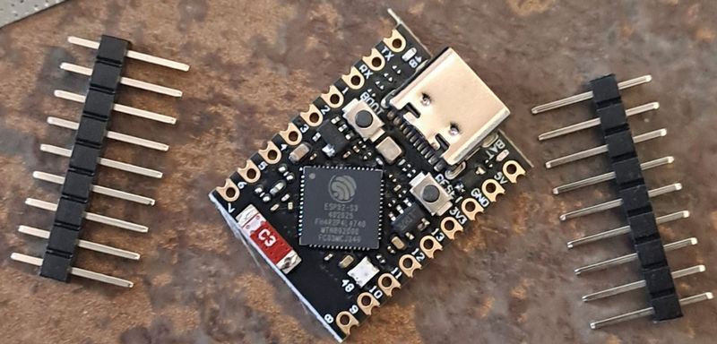
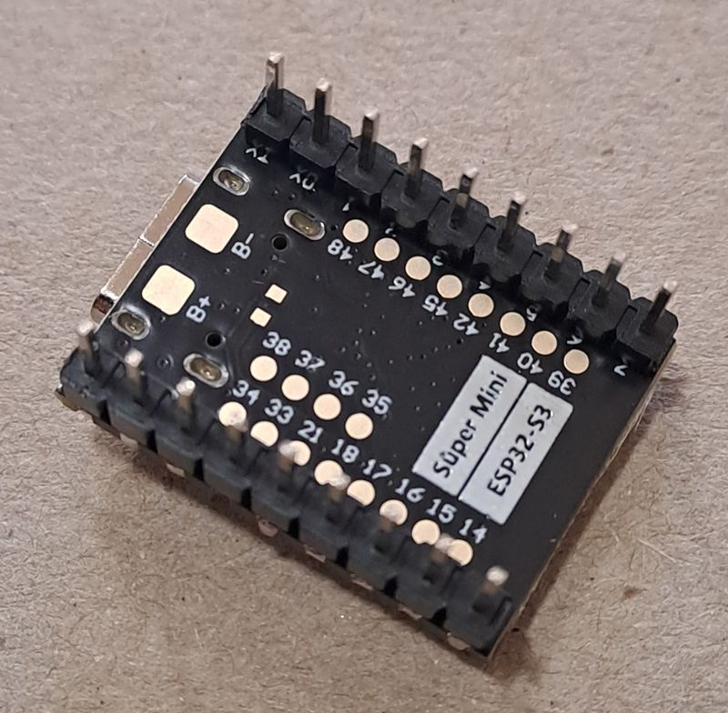

# ESP32‑S3‑Super Mini
## EXPLANATION FOR CARBON-BASED DEVELOPERS 😊

    

*English:* ESP32-S3-Super Mini is a very compact (approx. 22.5 x 18 mm) ESP32-S3 breakout board, sold by multiple vendors as a low-cost, small-footprint alternative to larger ESP32-S3 dev boards. It comes with an onboard Type-C USB connector for programming and power. The board used in this project is equipped with an ESP32-S3 chip featuring 4MB embedded Flash and 2MB embedded PSRAM (confirmed via `esptool` on this specific unit). It includes hardware encryption acceleration, RNG, HMAC and Digital Signature modules, and supports Wi-Fi + BLE 5.0. Board layout, silkscreen labels, and exact pin breakout can vary between vendors selling boards under this same name — always double-check against the specific unit in hand where in doubt.

**Important firmware note:** No dedicated CircuitPython board definition currently exists for "Super Mini" boards. This project currently runs CircuitPython built for the **Waveshare ESP32-S3-Zero** (`board_id` reports as such), which works because the underlying chip and most GPIO wiring is compatible. This means **some `board.*` aliases (e.g. `board.NEOPIXEL`) may reflect the Zero's pin assignment, not this board's actual wiring** — always verify aliases against the real hardware behavior (see LED section below) rather than trusting alias names blindly.

- Equipped with Xtensa® 32-bit LX7 dual-core processor, up to 240MHz main frequency.
- Supports 2.4GHz Wi-Fi (802.11 b/g/n) and Bluetooth® 5 (LE).
- Built-in 512KB SRAM, 384KB ROM, 4MB embedded Flash, 2MB embedded PSRAM (confirmed on this unit).
- Onboard WS2812 addressable RGB LED — wired to **GPIO48** on this board (not GPIO21, unlike the Zero).
- Onboard BOOT and RESET buttons both present on this unit.
- **Onboard Li-ion/LiPo battery charger chip and BAT+/BAT- pads:**  
Hardware CC/CV (constant-current/constant-voltage) charger, TP4054 chip. Safely charges a single-cell (3.7V nominal) Li-ion/LiPo battery to 4.2V via the USB-C port, then auto-cuts off. A small onboard LED lights while charging — this LED is driven directly by the TP4054's own status pin, not by the MCU, so there is no GPIO available to monitor charge status in software. Purely a hardware-level charging path; no software/GPIO handling is required for it at this time. If ADC-based battery voltage monitoring is added later, a specific GPIO/ADC pin will need to be chosen and documented here.  

*Magyar:* Az ESP32-S3-Super Mini egy nagyon kompakt (kb. 22,5 x 18 mm) ESP32-S3 modul, amit több gyártó is árul olcsó, kis helyigényű alternatívaként a nagyobb ESP32-S3 fejlesztői panelekhez. Type-C USB csatlakozóval rendelkezik programozáshoz és tápellátáshoz. A projektben használt modul 4MB beépített Flash-sel és 2MB beépített PSRAM-mal rendelkezik (a konkrét példányon `esptool`-lal megerősítve). Tartalmaz hardveres titkosítási gyorsítót, RNG-t, HMAC-ot és digitális aláírás modulokat, valamint Wi-Fi + BLE 5.0 támogatást. A panel elrendezése, a szitanyomat és a pontos kivezetett lábkiosztás gyártónként eltérhet ugyanazon névvel árult panelek között — kétség esetén mindig a konkrét, kézben lévő panelt kell ellenőrizni.

**Fontos firmware-megjegyzés:** Jelenleg nincs dedikált CircuitPython board-definíció a "Super Mini" panelekhez. Ez a projekt jelenleg a **Waveshare ESP32-S3-Zero**-hoz épített CircuitPython-t futtatja (a `board_id` is ezt jelzi), ami azért működik, mert az alapchip és a legtöbb GPIO-kiosztás kompatibilis. Ez azt jelenti, hogy **egyes `board.*` aliasok (pl. `board.NEOPIXEL`) a Zero lábkiosztását tükrözhetik, nem ennek a panelnek a tényleges bekötését** — mindig a valós hardver-viselkedéssel ellenőrizd az aliasokat (lásd LED szakasz lent), ne csak a névre hagyatkozz.

- Xtensa® 32-bites LX7 dual-core processzor, akár 240MHz órajel.
- 2,4GHz Wi-Fi (802.11 b/g/n) és Bluetooth® 5 (LE) támogatás.
- 512KB beépített SRAM, 384KB ROM, 4MB beépített Flash, 2MB beépített PSRAM (ezen a példányon megerősítve).
- Beépített WS2812 RGB LED — ezen a panelen **GPIO48**-ra van kötve (nem GPIO21-re, mint a Zero-nál).
- BOOT és RESET gomb is jelen van ezen a példányon.
- **Beépített Li-ion/LiPo akkumulátortöltő chip és BAT+/BAT- csatlakozó:**  
Hardveres CC/CV (konstans áram / konstans feszültség) töltő, TP4054 chip. Biztonságosan feltölt egy 1 cellás (3,7V névleges) Li-ion vagy LiPo akkut 4,2V-ra az USB-C porton keresztül, majd automatikusan lekapcsolja a töltést. Van a lapkán egy apró LED is, ami világít töltés közben — ezt a LED-et közvetlenül a TP4054 saját státuszkimenete hajtja, nem az MCU, tehát nincs GPIO, amin keresztül a töltés állapota szoftveresen figyelhető lenne. Tisztán hardveres töltési útvonal; jelenleg nincs szükség szoftveres/GPIO-kezelésre miatta. Ha később ADC-alapú akkufeszültség-mérés kerülne bevezetésre, ahhoz külön ki kell választani és dokumentálni egy konkrét GPIO/ADC pint.

> ⚠️ Az instrukció forrásai:
> - https://www.espboards.dev/esp32/esp32-s3-super-mini/
> - https://documentation.espressif.com/esp32-s3_datasheet_en.pdf
> - https://documentation.espressif.com/esp32-s3_technical_reference_manual_en.pdf
> - Saját `esptool` kiolvasás és `dir(board)` REPL-teszt a konkrét paneleden (lásd projekt-jegyzetek)

---
## NECESSARY DATA FOR THE AGENT
## GPIO Reference

ESP32-S3 uses a flexible GPIO matrix.
Digital peripherals such as SPI, I2C, I2S, PWM, and UART can be routed to almost any GPIO that is not internally reserved.
Operating Logic Voltage: 3.3V. Do not connect 5V logic signals directly to any GPIO.

Confirmed available pins on this unit (from `dir(board)` on the running CircuitPython): IO0–IO18, IO21, IO33–IO48 (as `IOx` and `Dx` aliases), plus `A0`–`A17` analog aliases, `RX`/`TX`, `BUTTON`, `NEOPIXEL`, `UART`. GPIO19/GPIO20 are **not** exposed as board pins (reserved for native USB).

### ADC mapping

ADC1: GPIO1–GPIO10
ADC2: GPIO11–GPIO20

Unlike classic ESP32, the ESP32-S3 CAN use ADC2 pins while Wi-Fi is active. For analog input with Wi-Fi enabled, GPIO1–GPIO10 (ADC1) remain the safest general default, but ADC2 pins (GPIO11–GPIO20) are also usable per the manufacturer's S3-specific correction.

Recommended analog inputs on this board: **GPIO1–GPIO10** (ADC1, commonly exposed, no Wi-Fi caveat).

# Reserved / dedicated pins

Do **not** use these pins for external peripherals.

|  GPIO  | Function |
|--------|----------|
| GPIO48 | Onboard WS2812 RGB LED (confirmed on this unit) |
| GPIO19 | USB D‑ |
| GPIO20 | USB D+ |
| GPIO33–37 | Likely PSRAM interface (not exposed on module) — carried over from same chip family; verify if issues arise |
| GPIO0 | Boot strap pin |

Notes:

- GPIO0 LOW during reset → **download mode**
- GPIO19/20 are used by **USB‑CDC**
- GPIO48 is wired to the **onboard WS2812 RGB LED** on this board — **do not rely on `board.NEOPIXEL`**; use `board.IO48` explicitly, since the currently-installed CircuitPython build is a Zero board definition and its `NEOPIXEL` alias may not point to GPIO48.
- GPIO21 is **free** on this board (unlike the Zero, where it drives the LED) — safe for general use.

# Pins best avoided (but usable if necessary)

| GPIO | Reason |
|------|--------|
| GPIO43 | Default UART TX |
| GPIO44 | Default UART RX |
| GPIO39–42 | JTAG interface |
| GPIO39 boot select PIN | - in this project *

JTAG mapping if used:

| Signal | GPIO |
|------|------|
| TCK | 39 | *
| TDO | 40 |
| TDI | 41 |
| TMS | 42 |

# Safe GPIO pool

These pins are typically free on this board and safe for peripherals. (GPIO21 included — free on Super Mini, unlike the Zero.)

GPIO1
GPIO2
GPIO3
GPIO4
GPIO5
GPIO6
GPIO7
GPIO8
GPIO9
GPIO10
GPIO11
GPIO12
GPIO13
GPIO14
GPIO15
GPIO16
GPIO17
GPIO18
GPIO21

*Notes:*
GPIO45–46 | Strapping pins. Use with caution (affects boot voltage/logs)
GPIO3 | Hidden strapping pin. Also use with caution (affects boot voltage/logs)
GPIO9–14 | Usable on this 4MB-flash/2MB-PSRAM (non-octal) variant, but double check against your specific unit's silkscreen/datasheet if problems occur — some ESP32-S3 variants with octal flash/PSRAM repurpose pins in this range.

# Recommended peripheral layout
Example layout that avoids internal buses. (Adjust per project — this project's display already uses IO9–IO13, see the display instructions file.)

## I2C (Inter-Integrated Circuit)
SDA → GPIO8
SCL → GPIO9

## SPI (SPI2 / FSPI)
MOSI → GPIO11
MISO → GPIO13
SCLK → GPIO12
CS → GPIO10 or GPIO4 or GPIO5

## I2S (Inter-IC Sound)
BCLK → GPIO4
LRCK → GPIO5
DOUT → GPIO6
DIN → GPIO7

## PWM
Any safe GPIO except:
19, 20, 48, 0

## Analog sensors
Preferred:
GPIO1–GPIO10

# USB rule
GPIO19 = USB D‑
GPIO20 = USB D+
Do not assign these pins to other peripherals.

# Boot / Reset rule
GPIO0 LOW during reset → Download mode.
Avoid circuits that pull GPIO0 low during boot.
This unit has both a BOOT and a separate RESET button — no need to short-circuit pins manually to reset.

# Built‑in RGB LED
The board contains a **WS2812 addressable RGB LED** connected to **GPIO48** on this unit.

**Important Rules:**
- A standard `digitalWrite`/`DigitalInOut` HIGH will **not** work on this addressable LED and must be avoided.
- **For CircuitPython (this project):** Use `neopixel.NeoPixel(board.IO48, 1, brightness=..., auto_write=...)` — confirmed working on this exact board with a color-wheel test. Do **not** use `board.NEOPIXEL`, since the alias comes from the Zero board definition currently in use and may not resolve to GPIO48.
- **For Arduino environments (Core v3.x+):** Prefer the native, lightweight `neopixelWrite(48, R, G, B)` function for simple color control instead of importing heavy external libraries.
- **For complex animations:** `FastLED` or `Adafruit_NeoPixel` may be used, but **never mix** them with `neopixelWrite()`.
- Only **one** driver or method should control the LED at any given time.
- This project currently does not use the onboard LED for its own UI/logic, but code generation should still avoid assigning GPIO48 to other peripherals, in case it is used later for status indication.

# Summary
Avoid:
GPIO0, GPIO19, GPIO20, GPIO48, GPIO33–37, GPIO45, GPIO46

Prefer:
GPIO1–GPIO18, GPIO21 (verify GPIO9–14 against your specific unit if issues arise)

### CODE GENERATION LOGIC & RULES

**1. Pin Selection & Exclusions:**
- **Strictly avoid** using GPIO 0, 19, 20, 48, 33-37, 45, and 46 for general inputs/outputs or peripherals.
- Always prefer GPIO 1–18 and GPIO 21 for standard user peripherals.
- GPIO21 is **safe to use** on this board (unlike the Zero board's instructions, where it is reserved for the LED) — do not carry over that exclusion by mistake.

**2. USB CDC vs. UART (Serial Output):**
- The onboard Type-C port is wired directly to the ESP32-S3's native USB OTG (GPIO 19 & 20), *not* through a UART bridge.
- When generating debug output or console logs, configure the environment to use **USB CDC On Boot** (e.g., standard `print()` over native USB in CircuitPython). Do not map logs to UART0 (GPIO 43/44) unless an external serial adapter is mentioned.

**3. ADC & Wi-Fi Compatibility (CRITICAL AI CORRECTION):**
- **Do not apply legacy ESP32 restrictions.** On the ESP32-S3, **ADC2 can be used simultaneously with Wi-Fi.** Feel free to allocate ADC2 pins (GPIO 11-20) for analog reading even if wireless networking is active.

**4. Onboard RGB LED (GPIO 48):**
- Treat GPIO 48 strictly as an addressable WS2812 data line. Never use basic digital write or standard PWM generation on this pin.
- Always address it as `board.IO48` in CircuitPython code for this project, not `board.NEOPIXEL` — see the firmware note above.

**5. Board Identity Caveat:**
- This board currently runs CircuitPython built for the Waveshare ESP32-S3-Zero. **Numeric pin references (`board.IO0`–`board.IO48`) are always safe** — they map directly to the chip's physical GPIO numbers regardless of which board definition is loaded.
- **Named/semantic aliases are NOT safe to trust blindly** — anything the Zero board definition maps by role rather than number (`board.NEOPIXEL`, `board.BUTTON`, and potentially others) reflects the *Zero's* physical layout, not necessarily this board's. Confirmed mismatch: `board.NEOPIXEL` does not point to this board's actual LED pin (GPIO48) — see above. `board.BUTTON` is unverified on this hardware and should not be used without testing.
- Prefer explicit `board.IOxx` pin references over named aliases in generated code for this project, unless a given alias has been explicitly verified against this hardware (as done for GPIO48/LED and RX/TX so far).

> **🤖 SYSTEM NOTE FOR THE AI AGENT:**
> This document defines hardware-specific operational rules, physical constraints, and pin routing for the ESP32-S3-Super Mini board used in this project. When generating code, **strictly enforce the pin exclusions and adapt the logic to the specific programming language/framework** (e.g., CircuitPython, Arduino, MicroPython) requested by the user. Prioritize modern S3 capabilities, but do not assume every alias from the underlying Zero board definition is accurate for this hardware — verify against confirmed pin behavior noted above.
