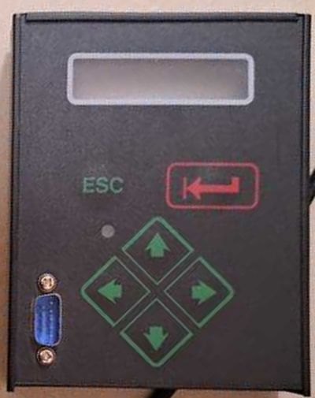
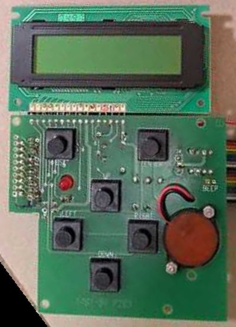
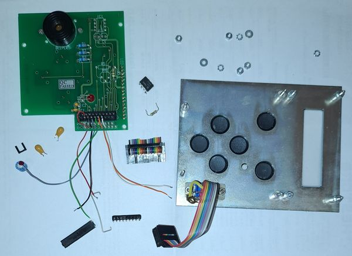
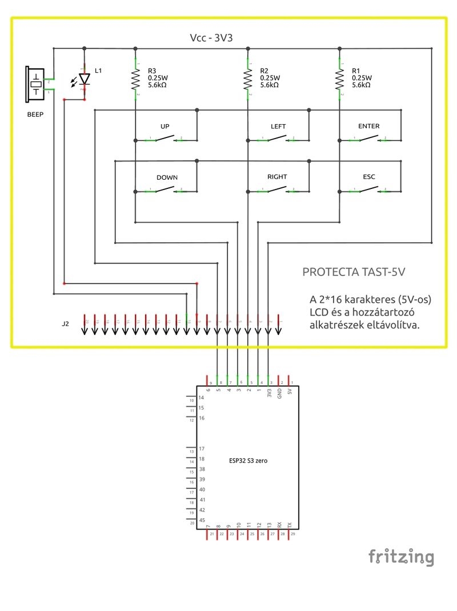

# 6-Button Matrix Keypad (3 columns × 2 rows)
### EXPLANATION FOR CARBON-BASED DEVELOPERS 😊
<table>
  <tr>
    <td align="center">
      
    </td>
    <td align="center">
      
    </td>
    <td align="center">
      
    </td>
    <td align="center">
      
    </td>
  </tr>
</table>

*English:*
This is a 6-button tactile keypad salvaged/repurposed from an older 5V panel that originally drove a 2×16 character LCD (that LCD and its driver electronics have been removed for this project). The 6 buttons are UP, DOWN, LEFT, RIGHT, ENTER, ESC, wired as a genuine 3-column × 2-row matrix — not 6 independent GPIO lines. Each column already has its own **physical 5.6kΩ pull-up resistor on the PCB** (to 3.3V), so no internal GPIO pull-up/pull-down configuration is needed on the column lines. Buttons are normally-open and close the circuit when pressed, pulling the sensed line **low** (active-low logic). The panel also carries a small piezo buzzer (BEEP) and a status LED (L1), both currently unused/reserved for future features — no GPIO is assigned to them yet.

*Magyar:*
Ez egy 6 gombos, nyomógombos billentyűzet, ami egy régebbi, 5V-os panelről lett újrahasznosítva. Eredetileg egy 2×16 karakteres LCD-t vezérelt (az LCD-t és a hozzá tartozó vezérlő elektronikát ehhez a projekthez eltávolítottam). A 6 gomb: UP, DOWN, LEFT, RIGHT, ENTER, ESC, valódi 3 oszlop × 2 sor mátrixba kötve — nem 6 független GPIO vonal. Minden oszlopnak saját, **fizikai 5,6kΩ felhúzó ellenállása van a panelen** (3,3V-ra), ezért az oszlopvonalakon nincs szükség belső GPIO pull-up/pull-down beállításra. A gombok normál nyitottak, nyomásra zárnak, és az érzékelt vonalat **alacsonyra** húzzák (aktív-alacsony logika). A panelen található még egy apró piezo hangjelző (BEEP) és egy státusz LED (L1) is, mindkettő jelenleg használaton kívül/fenntartva jövőbeli funkciókhoz — ezekhez még nincs GPIO hozzárendelve.

> ⚠️ Az instrukció forrásai:
> - Saját kapcsolási rajz (Fritzing export) és fotó a fizikai panelről
> - Projekt-egyeztetés a pontos GPIO-hozzárendelésről

---
## NECESSARY DATA FOR THE AGENT

### Pin Reference

| Signal                        | GPIO (this project) | Role in matrix                          |
| ------------------------------ | -------------------- | ---------------------------------------- |
| Column A (ENTER / ESC)         | `board.IO1`           | Sensed input, external pull-up (3.3V)     |
| Column B (LEFT / RIGHT)        | `board.IO2`           | Sensed input, external pull-up (3.3V)     |
| Column C (UP / DOWN)           | `board.IO3`           | Sensed input, external pull-up (3.3V)     |
| Row 2 (DOWN / RIGHT / ESC)     | `board.IO4`           | Driven scan line (active-low)             |
| Row 1 (UP / LEFT / ENTER)      | `board.IO5`           | Driven scan line (active-low)             |
| BEEP (piezo buzzer)            | *unassigned*          | Reserved for future use — do not use yet  |
| L1 (status LED)                | *unassigned*          | Reserved for future use — do not use yet  |

### Key-to-pin mapping

| Key   | Column (GPIO)     | Row (GPIO)        |
| ----- | ------------------ | ------------------ |
| UP    | Column C (`IO3`)   | Row 1 (`IO5`)       |
| DOWN  | Column C (`IO3`)   | Row 2 (`IO4`)       |
| LEFT  | Column B (`IO2`)   | Row 1 (`IO5`)       |
| RIGHT | Column B (`IO2`)   | Row 2 (`IO4`)       |
| ENTER | Column A (`IO1`)   | Row 1 (`IO5`)       |
| ESC   | Column A (`IO1`)   | Row 2 (`IO4`)       |

*Notes:*
- The 3 "column" lines (`IO1`, `IO2`, `IO3`) are the **sensed** lines — they read HIGH at rest (thanks to the onboard 5.6kΩ pull-ups) and LOW when the corresponding key is pressed and its row is being driven low.
- The 2 "row" lines (`IO4`, `IO5`) are the **scan-driven** lines — during matrix scanning, each row is driven low in turn while the columns are read.
- Do **not** enable internal GPIO pull-ups on `IO1`–`IO3` in addition to the external ones — redundant pulls on the same net are usually harmless but unnecessary; prefer leaving internal pulls disabled/default and rely on the physical resistors already on the PCB.
- BEEP and L1 are physically present on the same connector/PCB as the keypad, but have no assigned GPIO in this project yet. Do not generate code that drives them until a pin is explicitly assigned and documented here.

### CODE GENERATION LOGIC & RULES

**1. Library Choice:**
- Prefer CircuitPython's native `keypad.KeyMatrix` for scanning this matrix — it is non-blocking, debounced, and event-based (via `keypad.Event`), matching the project's non-blocking execution requirement (see `.copilot-instructions.md` Section 6).
- Do not hand-roll a manual row/column polling loop with `digitalio` unless `keypad.KeyMatrix` is explicitly unavailable or insufficient for the use case.

**2. Row/Column Assignment:**
- Configure `keypad.KeyMatrix` with **row_pins = (board.IO5, board.IO4)** and **column_pins = (board.IO1, board.IO2, board.IO3)**, matching the physical scan/sense roles described above — do not swap rows and columns, since the external pull-ups are only present on the column side.
- Map the resulting `(row, column)` key-number pairs from `keypad.KeyMatrix` events back to the named keys (UP, DOWN, LEFT, RIGHT, ENTER, ESC) using the key-to-pin table above — generate a lookup structure (e.g. a dict or small class) rather than relying on magic numbers scattered through the code.

**3. Event Handling:**
- Read key events via `keypad.Events` (`key_matrix.events.get()`) inside the main non-blocking loop; do not use `time.sleep()`-based polling.
- Distinguish key-press (`event.pressed`) from key-release (`event.released`) explicitly; do not assume every event is a press.
- Debounce is handled internally by `keypad.KeyMatrix` — do not add redundant manual debounce logic (e.g. extra delay-based checks) unless a specific real-world bounce issue is observed and documented.

**4. BEEP and L1 LED (Reserved):**
- Do not generate code referencing a GPIO for BEEP or L1 — no pin is assigned yet. If the user requests buzzer or status-LED functionality, ask for (or wait for) the specific GPIO assignment before generating code, rather than guessing a pin.

**5. Non-Blocking Integration:**
- Keypad scanning must run alongside display updates and measurement logic without blocking either — poll `key_matrix.events` once per main loop iteration (or per `asyncio` task tick), never inside a blocking wait.

> **🤖 SYSTEM NOTE FOR THE AI AGENT:**
> This document defines hardware-specific operational rules for the 6-button matrix keypad. When generating code, strictly respect the row/column pin roles (columns are externally pulled up and sensed; rows are actively driven low during scanning), use `keypad.KeyMatrix` for non-blocking, debounced input, and never assign GPIOs to the reserved BEEP/L1 signals without explicit confirmation from the user.  

Example:  
``` CircuitPython 10.x.x
# Keypad test script - 6-button 3x2 matrix
# Prints a prompt every 10 seconds, and reports which key was pressed.

import time
import board
import keypad

DEBUG = True


def dprint(*args, **kwargs) -> None:
    """Print debug messages when DEBUG mode is enabled."""
    if DEBUG:
        print(*args, **kwargs)


# --- Key matrix configuration ---
# Rows are the actively-driven scan lines; columns are externally
# pulled up (5.6kOhm on the PCB) and sensed.
ROW_PINS = (board.IO5, board.IO4)          # Row 1 (UP/LEFT/ENTER), Row 2 (DOWN/RIGHT/ESC)
COLUMN_PINS = (board.IO1, board.IO2, board.IO3)  # Column A (ENTER/ESC), B (LEFT/RIGHT), C (UP/DOWN)

key_matrix = keypad.KeyMatrix(row_pins=ROW_PINS, column_pins=COLUMN_PINS)

# key_number = row_index * len(COLUMN_PINS) + column_index
KEY_NAMES = {
    0: "ENTER",
    1: "LEFT",
    2: "UP",
    3: "ESC",
    4: "RIGHT",
    5: "DOWN",
}

PROMPT_INTERVAL = 10  # seconds
last_prompt = time.monotonic()

print("Nyomj meg egy gombot")

while True:
    now = time.monotonic()

    if now - last_prompt >= PROMPT_INTERVAL:
        print("Nyomj meg egy gombot")
        last_prompt = now

    event = key_matrix.events.get()
    if event and event.pressed:
        key_name = KEY_NAMES.get(event.key_number, "ISMERETLEN")
        timestamp_ms = int(time.monotonic() * 1000)
        dprint("Gomb lenyomva: {} (t={} ms)".format(key_name, timestamp_ms))
``` 
